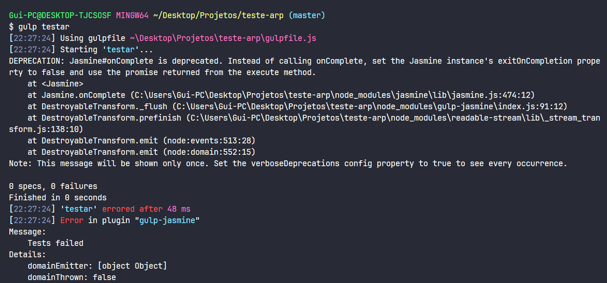
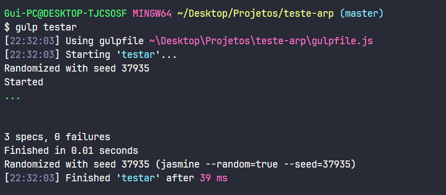

# ARP Ciclo - 3

```markdown
Engenharia de Software - Universidade Evangélica de Goiás
Verificação e Validação - Ciclo 3
Guilherme Gomes de Almeida - 2020890
```

### **Atividade: Desenvolver um Algoritmo para Calcular a Média de Três Notas Utilizando TDD**

   **Preparando ambiente (Trabalhando com JS)**

- Pré-requisitos: NodeJS, npm
- O Gulp é uma ferramenta de automação de construção de projetos, assim como Make (C), Ant e Maven (Java) e Rake (Ruby). O Gulp possibilita escrever scripts para executar tarefas comuns no mundo JavaScript, como ofuscar e minificar arquivos, converter de SASS/LESS para CSS e converter de CoffeeScript para JavaScript. No contexto do TDD Contínuo, o Gulp é útil para observar o sistema de arquivos e disparar a execução dos testes quando ocorrerem mudanças em arquivos existentes.

```markdown
npm -v
npm install gulp -g
npm init
npm install gulp gulp-jasmine --save-dev
```

**Escreva os Testes (Fase Red):**

- Configure o arquivo jasmine.json para que ele aponte para os arquivos de teste e os arquivos de código que você deseja testar. Um exemplo de configuração pode ser:Escrevendo testes.
    
    ```json
    {
      "spec_dir": "spec",
      "spec_files": [
        "**/*[sS]pec.js"
      ],
      "helpers": [
        "helpers/**/*.js"
      ],
      "stopSpecOnExpectationFailure": false,
      "random": true
    }
    ```
    
- Crie um diretório chamado spec e, dentro dele, crie um arquivo de teste, por exemplo, averageCalculatorSpec.js. Neste arquivo, você escreverá os testes:
    
    ```jsx
    const averageCalculator = require('../index');
    
    describe('averageCalculator', () => {
      it('should calculate the average of three valid grades', () => {
        expect(averageCalculator([90, 85, 88])).toBe(87.67);
      });
    
      it('should handle all grades being zero', () => {
        expect(averageCalculator([0, 0, 0])).toBe(0);
      });
    
      it('should handle grades with decimal values', () => {
        expect(averageCalculator([95.5, 87.25, 91.75])).toBe(91.5);
      });
    
      // Add more test cases as needed
    });
    ```
    
- Agora, implemente a função averageCalculator em um arquivo chamado index.js:
    
    ```jsx
    function averageCalculator(grades) {
      if (grades.length !== 3) {
        throw new Error('You must provide exactly three grades.');
      }
      const sum = grades.reduce((acc, grade) => acc + grade, 0);
      const average = sum / 3;
      return Number(average.toFixed(2)); // Round to two decimal places
    }
    
    module.exports = averageCalculator;
    ```
    
- Agora você pode usar o Gulp para executar os testes. Você pode manter seu arquivo gulpfile.js:
    
    ```jsx
    const gulp = require('gulp');
    const jasmine = require('gulp-jasmine');
    
    const caminhoFonte = 'index.js';
    
    gulp.task('testar', function () {
        return gulp.src(caminhoFonte)
            .pipe(jasmine());
    });
    
    gulp.task('tdd-continuo', gulp.series('testar', function () {
        gulp.watch(caminhoFonte, gulp.series('testar'));
    }));
    
    process.on('uncaughtException', function (e) {
        console.error(e.stack);
    });
    ```
    

**Execute os testes**

- Executar o comando de teste
    
    ```bash
    gulp testar
    ```
    
- Resultado dos teste
    

    
- Um erro foi obtido e significa que Nesse caso, o erro é relacionado ao uso do Jasmine e à função onComplete, que está obsoleta. Para resolver essa mensagem de depreciação, você pode seguir as instruções fornecidas: Em vez de chamar onComplete, configure a propriedade exitOnCompletion da instância do Jasmine como false e use a promessa retornada do método execute.

**Corrigindo e implementando o algoritmo**

```jsx
const gulp = require('gulp');
const jasmine = require('gulp-jasmine');
const Jasmine = require('jasmine');

const caminhoFonte = 'index.js';

gulp.task('testar', function (done) {
    const jasmine = new Jasmine();
    jasmine.loadConfigFile('jasmine.json'); // Carrega a configuração do Jasmine, se houver
    jasmine.exitOnCompletion = false; // Desativa a saída no final da execução
    jasmine.execute().then((success) => {
        if (success) {
            done();
        } else {
            done(new Error('Tests failed'));
        }
    });
});

gulp.task('tdd-continuo', gulp.series('testar', function () {
    gulp.watch(caminhoFonte, gulp.series('testar'));
}));

process.on('uncaughtException', function (e) {
    console.error(e.stack);
});
```

- Resultado no terminal
    

    

**Refatorando para melhorar**

- Foi adicionando a função a sintaxe de arrow function para modernizar a sua sintaxe

```jsx
const averageCalculator = (grades) => {
    if (grades.length !== 3) {
        throw new Error('You must provide exactly three grades.')
    }
    const sum = grades.reduce((acc, grade) => acc + grade, 0)
    const average = sum / 3
    return Number(average.toFixed(2))
}

module.exports = averageCalculator;
```

- Resultado final
    
    ```bash
    gulp testar
    ```
    

    

[https://github.com/oguialmeida/TDD-Simple](https://github.com/oguialmeida/TDD-Simple)
