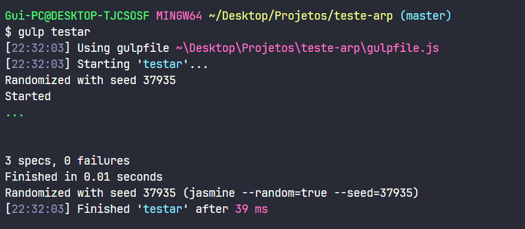
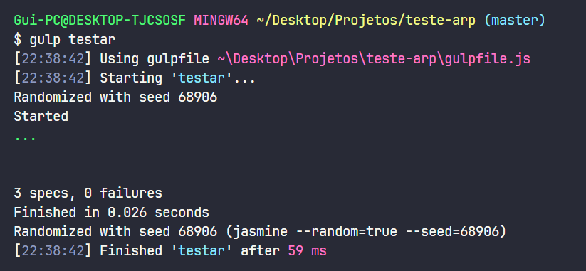

<!DOCTYPE html>
<html lang="en">
<head>
<meta charset="UTF-8" />
<meta name="viewport" content="width=device-width, initial-scale=1" />
</head>
<body>

<h1>Setting Up the Environment (Working with JS)</h1>

<ul>
  <li><strong>Prerequisites:</strong> NodeJS, npm</li>
  <li>Gulp is a project build automation tool, similar to Make (C), Ant and Maven (Java), and Rake (Ruby). Gulp allows you to write scripts to perform common tasks in the JavaScript world, such as minifying and uglifying files, converting SASS/LESS to CSS, and converting CoffeeScript to JavaScript. In the context of Continuous TDD, Gulp is useful for watching the file system and triggering test runs whenever existing files change.</li>
</ul>

<pre><code>npm -v
npm install gulp -g
npm init
npm install gulp gulp-jasmine --save-dev
</code></pre>

<h2>Write the Tests (Red Phase):</h2>

Configure the <code>jasmine.json</code> file to point to the test files and the code files you want to test. An example configuration might look like this:

<pre><code>{
  "spec_dir": "spec",
  "spec_files": [
    "**/*[sS]pec.js"
  ],
  "helpers": [
    "helpers/**/*.js"
  ],
  "stopSpecOnExpectationFailure": false,
  "random": true
}
</code></pre>

Create a directory named <code>spec</code> and inside it create a test file, for example, <code>averageCalculatorSpec.js</code>. In this file, write your tests:

<pre><code>const averageCalculator = require('../index');

describe('averageCalculator', () => {
  it('should calculate the average of three valid grades', () => {
    expect(averageCalculator([90, 85, 88])).toBe(87.67);
  });

  it('should handle all grades being zero', () => {
    expect(averageCalculator([0, 0, 0])).toBe(0);
  });

  it('should handle grades with decimal values', () => {
    expect(averageCalculator([95.5, 87.25, 91.75])).toBe(91.5);
  });

  // Add more test cases as needed
});
</code></pre>

Now implement the <code>averageCalculator</code> function in a file named <code>index.js</code>:

<pre><code>function averageCalculator(grades) {
  if (grades.length !== 3) {
    throw new Error('You must provide exactly three grades.');
  }
  const sum = grades.reduce((acc, grade) => acc + grade, 0);
  const average = sum / 3;
  return Number(average.toFixed(2)); // Round to two decimal places
}

module.exports = averageCalculator;
</code></pre>

You can now use Gulp to run the tests. Keep your <code>gulpfile.js</code> like this:

<pre><code>const gulp = require('gulp');
const jasmine = require('gulp-jasmine');

const sourcePath = 'index.js';

gulp.task('test', function () {
    return gulp.src(sourcePath)
        .pipe(jasmine());
});

gulp.task('continuous-tdd', gulp.series('test', function () {
    gulp.watch(sourcePath, gulp.series('test'));
}));

process.on('uncaughtException', function (e) {
    console.error(e.stack);
});
</code></pre>

<h2>Run the Tests</h2>

Run the test command:

<pre><code>gulp test
</code></pre>

Test result:

An error was encountered related to Jasmine's deprecated <code>onComplete</code> function. To fix this deprecation warning, configure Jasmine's <code>exitOnCompletion</code> property as <code>false</code> and use the promise returned by the <code>execute</code> method instead of using <code>onComplete</code>.

<h2>Fixing and Implementing the Algorithm</h2>

<pre><code>const gulp = require('gulp');
const jasmine = require('gulp-jasmine');
const Jasmine = require('jasmine');

const sourcePath = 'index.js';

gulp.task('test', function (done) {
    const jasmine = new Jasmine();
    jasmine.loadConfigFile('jasmine.json'); // Load Jasmine config file if available
    jasmine.exitOnCompletion = false; // Disable exit on completion
    jasmine.execute().then((success) => {
        if (success) {
            done();
        } else {
            done(new Error('Tests failed'));
        }
    });
});

gulp.task('continuous-tdd', gulp.series('test', function () {
    gulp.watch(sourcePath, gulp.series('test'));
}));

process.on('uncaughtException', function (e) {
    console.error(e.stack);
});
</code></pre>

Terminal output:

<h2>Refactoring for Improvement</h2>

The function was refactored to use arrow function syntax for modernity:

<pre><code>const averageCalculator = (grades) => {
    if (grades.length !== 3) {
        throw new Error('You must provide exactly three grades.')
    }
    const sum = grades.reduce((acc, grade) => acc + grade, 0)
    const average = sum / 3
    return Number(average.toFixed(2))
}

module.exports = averageCalculator;
</code></pre>

Final result:

<pre><code>gulp test
</code></pre>

</body>
</html>
